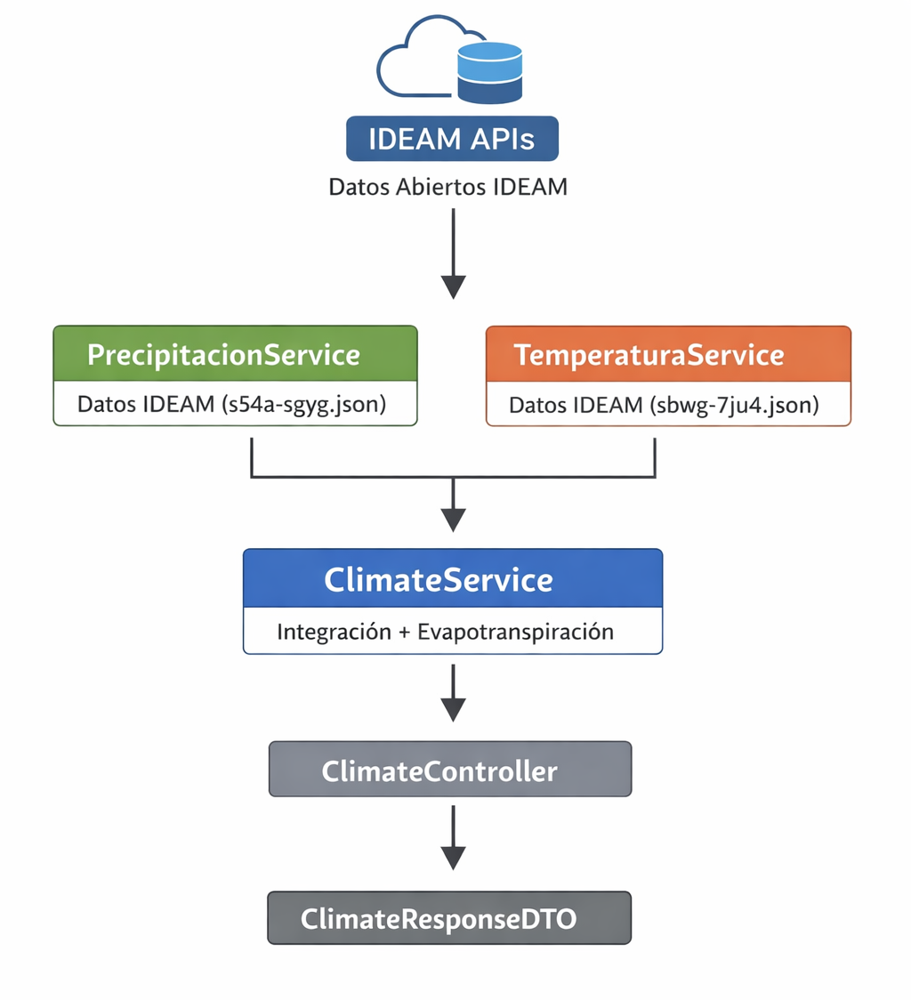

# 🌦️ Climate Microservice — IDEAM

Microservicio desarrollado en **Spring Boot (Java)** que consume datos abiertos del IDEAM para generar un reporte climático por municipio en Colombia.

El servicio integra información de **precipitación y temperatura**, calcula **evapotranspiración estimada (Thornthwaite simplificado)** y entrega interpretaciones técnicas en un formato estructurado (DTO).

---

## 🎯 Objetivo del proyecto

Proveer un **endpoint REST por municipio** que:

- Obtenga datos reales desde APIs públicas del IDEAM (datos.gov.co).
- Promedie precipitación y temperatura por municipio.
- Estime **evapotranspiración potencial** con un método aceptado.
- Estructure la respuesta en un DTO claro y usable.
- Maneje errores con excepciones personalizadas y control global.

---

## 🧱 Arquitectura del microservicio

Esta arquitectura separa responsabilidades y facilita mantenimiento, pruebas y escalabilidad.



---

## 🚀 Tecnologías utilizadas

- Java 17  
- Spring Boot  
- Spring Web (RestTemplate)  
- DTOs personalizados  
- Manejo global de excepciones con `@RestControllerAdvice`  
- Consumo de APIs públicas de IDEAM  

---

## 🔗 Endpoint principal

GET /api/v1/climate/{municipio}

### Ejemplo de uso:

http://localhost:8080/api/v1/climate/bogota

---

## 📄 Ejemplo de respuesta (JSON)

```json
{
  "estacion": "Estación IDEAM",
  "municipio": "Bogotá",
  "departamento": "Cundinamarca",
  "unidadPrecipitacion": "mm",
  "precipitacionMensualMm": 82.5,
  "unidadTemperatura": "°C",
  "temperaturaMediaC": 18.3,
  "unidadEvapotranspiracion": "mm/dia",
  "evapotranspiracionMmDia": 1.45,
  "fechaRegistro": "2026-02-06",
  "interpretacionTecnicaPrecipitacion": "Precipitación moderada: condiciones estables.",
  "interpretacionTecnicaTemperatura": "Temperatura de clima frío"
}
```

## 🧮 Cálculo de evapotranspiración

Se utiliza una versión simplificada del método de Thornthwaite, adecuada cuando solo se dispone de temperatura media mensual.

### Características del enfoque:

- Basado principalmente en temperatura media.
- Aceptado en estudios hidrológicos y ambientales.
- Resultado normalizado a mm/día para interpretación práctica.
- Más sólido y defendible que fórmulas arbitrarias.

---

##⚠️ Manejo de errores

Si el municipio no existe en los datos del IDEAM, el servicio retorna:
404 NOT FOUND

### Ejemplo de respuesta:

```json
{
  "error": "Municipio no encontrado: sopo"
}
```
Esto se gestiona mediante:

- MunicipioNotFoundException
- GlobalExceptionHandler con @RestControllerAdvice

---

###🧪 Cómo ejecutar el proyecto

1. Clona el repositorio
2. Abre con IntelliJ IDEA o VS Code
3. Ejecuta la clase principal de Spring Boot
4. Prueba con: http://localhost:8080/api/v1/climate/bogota

Puedes usar el Navegador, Postman, o Thunder Client

---

## 📌 Aportes técnicos del proyecto

Este microservicio demuestra:

- Integración con APIs reales del Estado colombiano.
- Transformación y limpieza de datos externos.
- Cálculo propio de variables ambientales.
- Uso de DTOs estructurados.
- Manejo profesional de excepciones.
- Diseño modular con servicios independientes.

---

## 👨‍💻 Autor

### Sebastián Moreno
Tecnólogo en Análisis y Desarrollo de Software — SENA 
Ingeniero Civil 
Bogotá, Colombia 

